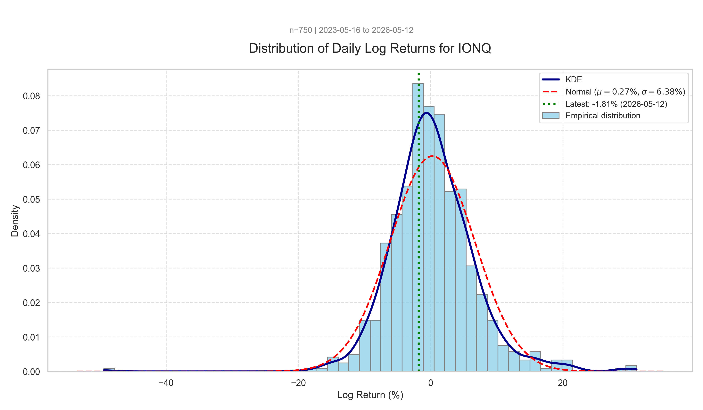

# histogram.py - Return Distribution Analysis

Visualiserar fördelningen av dagliga log-returns för en aktie och jämför med normalfördelning.

## Användning

```bash
python histogram.py TICKER       # Analysera specifik aktie
python histogram.py              # Default: ^OMXSBCAPGI
python histogram.py EQT.ST --years 5 --bins 75 --threshold 2.5
```

**Input:** `data/TICKER.csv`
**Output:** `histogram_TICKER.png`, `histogram_TICKER.txt`, `histogram_TICKER.csv`

## Konfiguration

| Parameter | Default | Beskrivning |
|-----------|---------|-------------|
| `ticker` | ^OMXSBCAPGI | Aktie att analysera |
| `--years` | 3 | År av historik |
| `--bins` | 50 | Antal staplar i histogrammet |
| `--threshold` | 3.0 | Sigma-gräns för outliers |
| `--data-dir` | data | Datakatalog |

## Output

**PNG-graf visar:**
- Histogram (ljusblå) - empirisk fördelning
- KDE-kurva (mörkblå) - utjämnad faktisk fördelning
- Normalfördelning (röd streckad) - teoretisk referens
- Senaste return (grön linje)

**TXT-rapport innehåller:**
- Daglig och årlig μ (medelvärde) och σ (volatilitet)
- Skewness och kurtosis med tolkning
- Jarque-Bera normalitetstest
- Fat tail multiplier (empiriska / teoretiska outliers)
- Tail ratio (asymmetri i extremsvansar)
- Empiriska vs normala percentiler (1:a, 5:e)
- Lista över extrema outliers med datum

**CSV-rapport** (`histogram_TICKER.csv`) — en rad, maskinläsbar:

| Kolumn | Beskrivning |
|--------|-------------|
| `Ticker` | Aktiesymbol |
| `Observations` | Antal dagliga returns |
| `Start`, `End` | Periodens start- och slutdatum |
| `Daily_Mean`, `Daily_Std` | μ och σ för dagliga log-returns |
| `Annual_Mean`, `Annual_Volatility` | Annualiserade värden (×252 resp. ×√252) |
| `Skewness`, `Kurtosis` | Pearson-kurtosis (normal = 3) |
| `Outliers`, `Outlier_Pct` | Antal och andel utanför ±threshold·σ |
| `Fat_Tail_Mult` | Empiriska outliers / teoretiska under normal |
| `JB_Stat`, `JB_PValue` | Jarque-Bera testresultat |
| `Tail_Ratio` | Genomsnittlig magnitud neg-svans / pos-svans |
| `Empirical_1Pct`, `Normal_1Pct` | 1:a percentilen empiriskt vs teoretiskt |
| `Empirical_5Pct`, `Normal_5Pct` | 5:e percentilen empiriskt vs teoretiskt |

## Tolkning

| Kurva | Beskrivning |
|-------|-------------|
| **KDE** | Faktisk fördelning - icke-parametrisk, fångar asymmetri och feta svansar |
| **Normal** | Teoretisk referens - antar klockkurva med samma μ och σ |

**Typiska observationer:**
- KDE-topp högre och smalare än normal → leptokurtisk (feta svansar)
- Extrema rörelser förekommer oftare än normalfördelningen förutspår
- Därför underskattar normalfördelningen svansrisken

## Statistik

Tröskelvärdena nedan är heuristiker — inte hårda gränser.

| Mått | Tolkning |
|------|----------|
| **Skewness < -0.5** | Vänsterskev - fler extrema negativa returns |
| **Skewness > 0.5** | Högerskev - fler extrema positiva returns |
| **Kurtosis > 3** | Leptokurtisk - fetare svansar än normal |
| **Kurtosis < 3** | Platykurtisk - tunnare svansar än normal |

Scriptet använder **Pearson-kurtosis** (`fisher=False`), där normal = 3.
Scipy:s default är excess kurtosis där normal = 0 — blanda inte ihop.

Årlig volatilitet: `σ_daily × √252`

### Jarque-Bera

Kombinerar skewness + kurtosis i ett normalitetstest.

- **p < 0.05** → avvisa normalfördelning (datat är inte normalt)
- **p ≥ 0.05** → kan inte avvisa normalitet

För svenska aktier med 3+ år data avvisas normalitet nästan alltid — frågan är hur grov approximationen är.

### Fat Tail Multiplier

`empiriska outliers / teoretiskt förväntade under normal`

- **1.0x** → svansarna matchar normalfördelningen
- **3x** → tre gånger fler ±3σ-dagar än normal förutspår
- **>5x** → kraftigt leptokurtisk, normal är dålig modell för svansrisk

Vid threshold = 3.0σ är teoretisk frekvens ~0.27%. Empiriskt brukar aktier ligga 3-10x över.

### Tail Ratio

`mean(|neg-svans|) / mean(|pos-svans|)` — jämför magnitud i extremerna.

- **> 1.2** → nedsidan dominerar (asymmetrisk crash-risk)
- **0.8 - 1.2** → ungefär symmetrisk
- **< 0.8** → uppsidan dominerar (ovanligt)

## Annualisering av log-avkastning

Daglig log-avkastning annualiseras genom enkel multiplikation:

```
μ_annual = μ_daily × 252
```

**Varför `μ × 252` istället för `(1+μ)^252 - 1`?**

Log-avkastning är **additiv** över tid. Om dagliga log-returns är r₁, r₂, r₃... så är total log-avkastning = r₁ + r₂ + r₃ + ...

Detta skiljer sig från enkel procentuell avkastning som är multiplikativ.

**Exempel:**
- Daglig log-avkastning: 0.165%
- Annualiserad: 0.165% × 252 = 41.6%

**Konvertering till faktisk prisförändring:**

Log-avkastning och faktisk prisförändring är inte samma sak:

```
Faktisk avkastning = e^(log_return) - 1
```

Så 41.6% årlig log-avkastning motsvarar `e^0.416 - 1 = 51.6%` faktisk prisökning.

**Intuition för gapet:** log-avkastning motsvarar kontinuerligt sammansatt ränta. 41.6% kontinuerligt blir mer än 41.6% enkel avkastning eftersom "ränta på ränta" verkar oavbrutet under året.

## Exempel-output (TXT-utdrag)

```
LOG RETURN HISTOGRAM REPORT - IONQ
==================================================
Observations: 750
Period: 2023-05-16 to 2026-05-12

Daily mean (μ): 0.002706 (0.271%)
Daily std dev (σ): 0.063825 (6.382%)
Annualized mean: 68.20%
Annualized volatility: 101.32%
Skewness: 0.0853
Kurtosis: 9.5860

(Annualization based on 252 trading days)

Distribution is approximately symmetric (skewness near 0).
Distribution is leptokurtic (kurtosis > 3) - fatter tails than normal.

FAT TAILS ANALYSIS
--------------------------------------------------
Jarque-Bera test: stat=1356.4, p=2.887e-295  → NOT normal

Extreme outliers (> ±3.0σ): 9 (1.20%)
Expected under normal distribution: 0.27%
Fat tail multiplier: 4.4x
Tail ratio (neg/pos magnitude): 2.05x  → downside dominates

EMPIRICAL vs NORMAL TAIL PERCENTILES
--------------------------------------------------
  1st percentile:  empirical -14.11%  vs  normal -14.58%
  5th percentile:  empirical -8.94%  vs  normal -10.23%

OUTLIER DETAILS
--------------------------------------------------
2025-05-22: 31.13%
2024-11-07: 29.57%
2025-01-15: 28.88%
2025-04-09: 21.45%
2024-12-16: 21.18%
2023-06-28: 21.10%
2023-05-22: 20.13%
2026-02-26: 19.64%
2025-01-08: -49.43%

Rapport skapad: 2026-05-13 12:58
```
